# PlantNest — Technical Requirements Document (TRD)

**Version 1.0 — July 2026**
**Prepared as a companion to the PlantNest PRD (v1.0, June 2026)**

---

## 1. Document Overview

This Technical Requirements Document (TRD) translates the PlantNest Product Requirements Document (PRD) into a concrete, implementable technical design. It defines the architecture, data model, APIs, AI system design, and engineering standards needed to build PlantNest as a single-developer B.Tech major project over approximately three months.

This document assumes the reader has already read the PRD. It does not restate business justification, personas, or market analysis — it exists to answer "how do we build this," not "why are we building this."

**Note on technology stack:** The PRD (Section 29) sketches a Next.js + Supabase-only stack as one reasonable option. This TRD adopts a different, equally free-tier-friendly stack — React/Vite/TypeScript on the frontend, a dedicated FastAPI backend, and Agno-orchestrated multi-agent AI instead of a single third-party diagnosis API. This is a technical implementation decision, not a change to product scope: every functional requirement, module, and phase boundary defined in the PRD is preserved as-is.

## 2. Purpose

The purpose of this TRD is to give a single developer (and their evaluators) an unambiguous technical blueprint: what services exist, how they communicate, what the database looks like, how the AI pipeline is structured, and what "done" looks like for each subsystem — so that implementation decisions are made once, during design, rather than repeatedly during coding.

## 3. Scope

**In scope:** system architecture, backend and frontend architecture, database schema, API contracts, the multi-agent AI system (disease detection, RAG, LLM reasoning), authentication/authorization, storage, notifications, marketplace payment integration (test mode), expert consultation architecture, background processing, security, logging, deployment, and folder/coding standards.

**Out of scope (per instructions and PRD phasing):** ADRs, the PRD itself, an SRS, implementation code, wireframes/UI mockups, native mobile apps, IoT integration, video/chat SDK build-out beyond architecture description, and enterprise-grade monitoring/observability stacks.

## 4. Technical Goals

- Deliver every MVP (P1), P2, and P3 feature from the PRD on a modular monolithic backend that a single developer can reason about end-to-end.
- Build a genuinely trained, self-hosted disease detection model (Kaggle-sourced) rather than depending on a rate-limited commercial API, while keeping inference cost and latency realistic for a free-tier deployment.
- Use a multi-agent AI architecture (Agno + Gemini 2.5 Flash) so diagnosis, research, care advice, and recommendations are separated into auditable, individually testable responsibilities rather than one large prompt.
- Keep infrastructure entirely on free/sandbox tiers (Vercel, Render, Supabase, Razorpay Test Mode) with no self-managed servers, queues, or caches beyond what Postgres and pgvector already provide.
- Ship a codebase that remains explainable in a viva: consistent naming, a shallow folder structure, and no framework or pattern introduced without a clear justification tied back to a PRD requirement.

## 5. Overall System Architecture

PlantNest is a three-tier web application: a React SPA, a FastAPI modular monolith, and a managed PostgreSQL database (via Supabase) with pgvector for embeddings. Supabase additionally provides authentication and object storage, so the backend never manages passwords or raw files directly. Gemini 2.5 Flash, orchestrated by Agno, provides the reasoning layer for the AI features; ExaTools and FirecrawlTools give agents controlled access to the open web for research and knowledge-base updates.

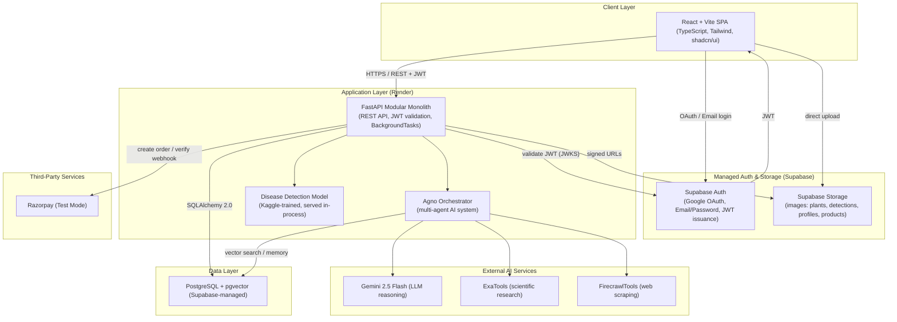

**Rationale:** Every arrow in this diagram maps to a managed service already covered by a generous free tier, keeping the developer's effort on product logic rather than infrastructure operations — consistent with the PRD's founding constraint (Section 26) of spending zero effort on infrastructure a managed service already does well.

## 6. High-Level Architecture

At a high level, PlantNest has four cooperating subsystems:

| Subsystem | Responsibility | Technology |
| --- | --- | --- |
| Presentation | Renders UI, manages client state, calls REST APIs | React, Vite, TypeScript, Tailwind, shadcn/ui |
| Application | Business logic, validation, orchestration, REST contracts | FastAPI, SQLAlchemy 2.0, Pydantic |
| AI System | Disease inference, retrieval, reasoning, recommendation | Agno agents, Kaggle-trained CNN, Gemini 2.5 Flash, pgvector RAG |
| Data & Platform | Persistence, auth, file storage, payments | PostgreSQL (Supabase), Supabase Auth, Supabase Storage, Razorpay |

The application layer is a **single deployable FastAPI service** internally organized into modules (auth, plants, detections, reminders, marketplace, community, experts, notifications, ai). This is a deliberate rejection of microservices: at the traffic and team-size this project targets, network calls between services would add latency and operational surface without any corresponding benefit — the PRD's own scalability section makes the same call for the reference stack, and this TRD keeps that reasoning for the FastAPI implementation.

## 7. Low-Level Architecture

Within the FastAPI service, each module follows the same internal layering to keep the codebase predictable:

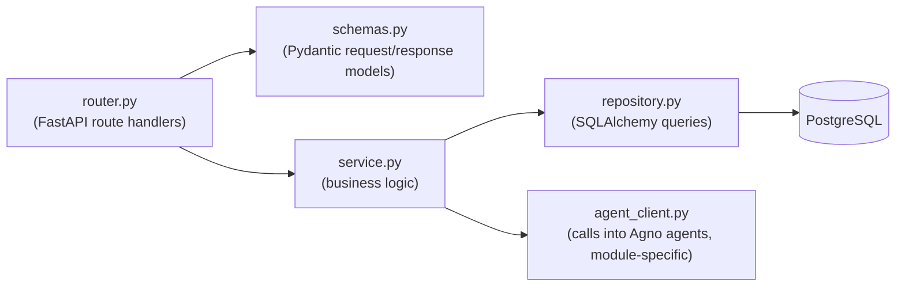

Routers never talk to the database directly; they call a service function, which may call one or more repository functions and, for AI-driven modules, an agent client. This keeps route handlers thin and testable, and keeps SQL confined to the repository layer.

## 8. Component Architecture

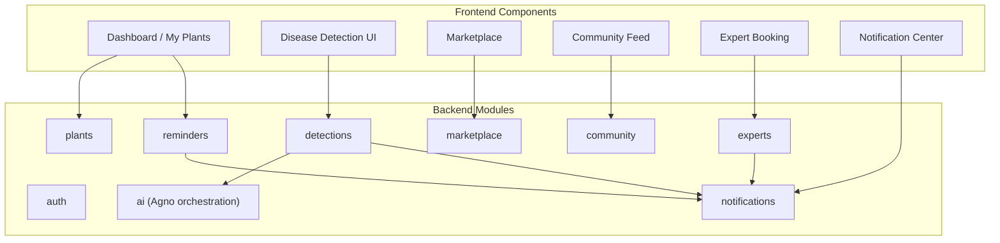

Each backend module owns its own tables and exposes only its router's endpoints to the outside; cross-module reads (e.g., the detection module reading a plant's species) go through the owning module's service function, never through direct cross-module table access, so that module boundaries stay real even inside a single deployable.

## 9. AI System Architecture

The AI system is the most distinctive part of PlantNest and is deliberately built as a **multi-agent system orchestrated by Agno**, not a single prompt to Gemini. This mirrors the PRD's core UX principle (Section 18): diagnosis has to lead somewhere — treatment, product, or a human expert — and a single generic chatbot tends to blur those distinct responsibilities together.

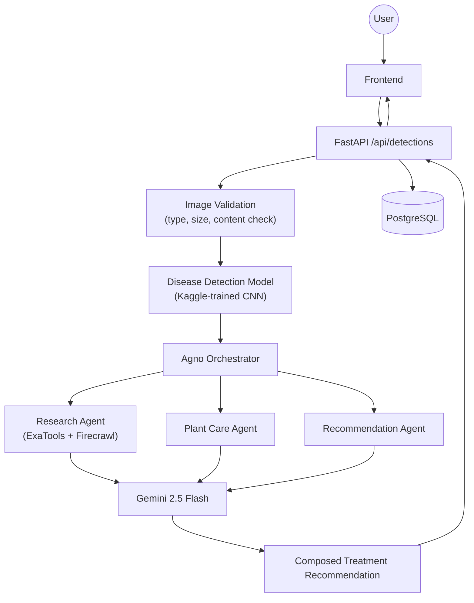

## 10. Multi-Agent Architecture

Agno acts as the orchestrator that routes a task to the right specialized agent(s), rather than exposing one monolithic "assistant" that tries to do diagnosis, research, and conversation in a single prompt. Five agents are defined:

| Agent | Trigger | Primary Tooling |
| --- | --- | --- |
| Diagnosis Agent | New detection submitted | Kaggle CNN output + Gemini for natural-language explanation |
| Research Agent | Diagnosis confidence is mid-to-high, or a user asks a care question | ExaTools, FirecrawlTools, pgvector RAG |
| Plant Care Agent | Detection completed, or a reminder/advisory is due | Gemini + user's plant/reminder history from Postgres |
| Recommendation Agent | Treatment identified | Gemini + marketplace product catalogue query |
| Expert Support Agent | Confidence below threshold, or user explicitly requests a human | Booking module + Gemini (drafts a suggested question for the expert) |

Agents are implemented as Agno `Agent` instances, each configured with a narrow system prompt, a specific toolset, and access only to the memory namespaces it needs (Section 15). This narrow scoping is what keeps prompts small, outputs predictable, and failures isolated — if the Research Agent's web tool fails, diagnosis and care advice still complete.

## 11. Agent Responsibilities

- **Diagnosis Agent** — Takes the CNN's predicted disease class and confidence score and turns it into a plain-language explanation a non-technical gardener can understand; does not call any external tools, only Gemini, keeping this step fast.
- **Research Agent** — Given a disease name, queries the pgvector knowledge base first (Section 14); if retrieved context is thin, falls back to ExaTools for scientific sources and FirecrawlTools to pull structured treatment content from trusted gardening sites, then writes the result back into the knowledge base for future reuse.
- **Plant Care Agent** — Combines the diagnosis, the plant's `location_type` (balcony/indoor/terrace, from the PRD's data model) and recent weather to produce care guidance that accounts for potted, not field, conditions — directly implementing the PRD's balcony-first USP (Section 10) inside the AI layer itself.
- **Recommendation Agent** — Maps a treatment (e.g., "neem oil spray") to matching marketplace products via a Postgres query, ranked by seller proximity and rating, and asks Gemini to write a one-line justification for the top pick.
- **Expert Support Agent** — Activated only on the low-confidence path; does not attempt a diagnosis itself. It summarizes the ambiguous detection into a short brief that pre-fills the expert booking form, reducing back-and-forth once a human is engaged.

## 12. Agent Communication Flow

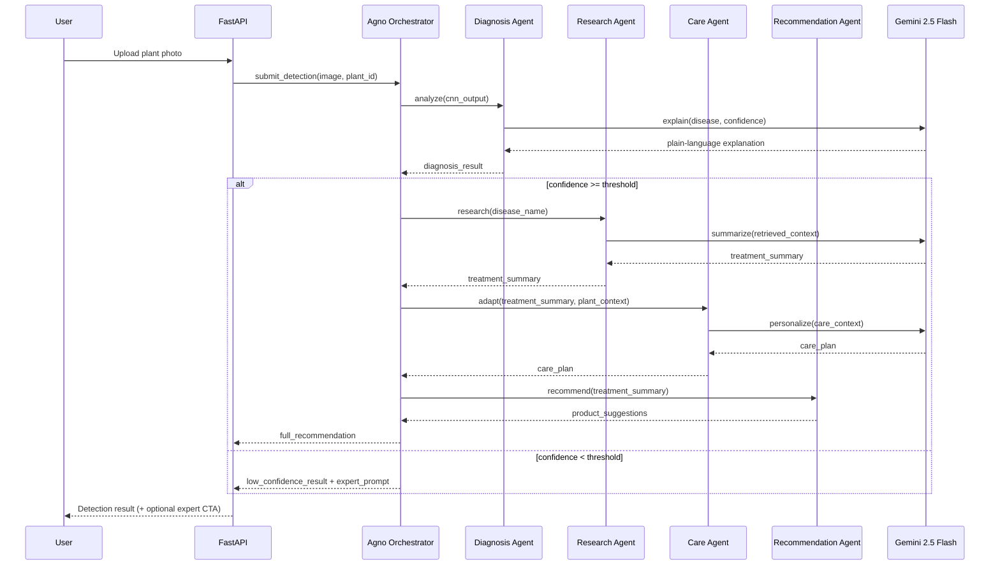

Agno's orchestrator holds this control flow in code (not inside a single prompt), so the branching on confidence threshold — the PRD's Section 13.3 trust-building rule — is an explicit, testable `if` statement rather than something the LLM has to reliably infer.

## 13. AI Inference Pipeline

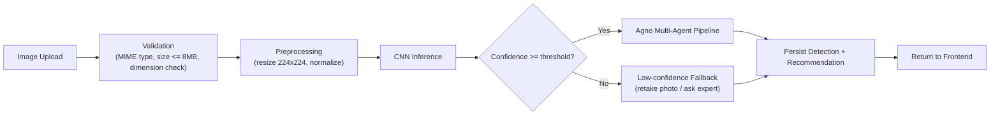

Inference runs synchronously within the request for typical cases (target: under 5 seconds, matching the PRD's NFR), since the model is small enough to serve in-process on Render without a GPU. If Gemini or a tool call in the agent pipeline is slow, that portion is wrapped in a timeout and degrades to the diagnosis-only result plus a "recommendation still generating" background task rather than blocking the whole request.

## 14. RAG Architecture

Retrieval-Augmented Generation grounds the Research and Care agents in real gardening knowledge instead of relying purely on the LLM's parametric memory, which reduces hallucinated treatment advice — a real risk given the PRD's emphasis on trust (Section 10).

**Knowledge sources:** metadata and disease/treatment descriptions derived from the same Kaggle dataset used to train the detection model, supplemented over time by FirecrawlTools-scraped gardening articles that pass a basic quality filter.

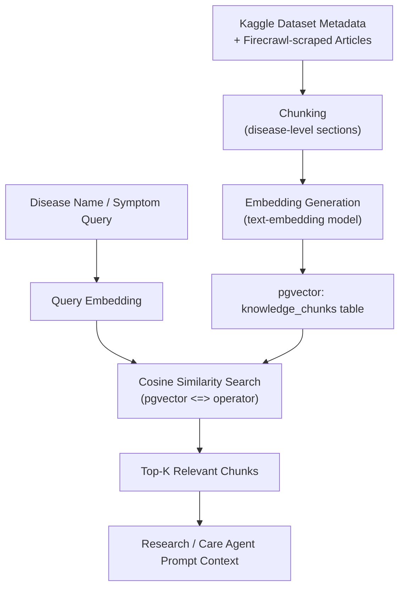

- **Embedding generation:** each knowledge chunk (one disease's symptoms/treatment/prevention block) is embedded once at ingestion time and stored in a `knowledge_chunks` table with a `vector(768)` (or matching model dimension) column indexed with an IVFFlat or HNSW index via pgvector.
- **Vector search:** at query time, the disease name plus any user-supplied symptom text is embedded and compared against stored vectors using cosine distance; the top 4–6 chunks are retrieved.
- **Retrieval flow:** retrieved chunks are inserted into the Research Agent's prompt as grounding context, with the agent instructed to prefer retrieved facts over general knowledge and to cite which chunk supported which claim (kept internal, not shown to the user, to avoid UI clutter).

## 15. Prompt Engineering Strategy

- Each agent has a fixed, narrow **system prompt** describing only its responsibility (e.g., the Care Agent's prompt never mentions marketplace products), which keeps outputs on-task and shortens the prompt, reducing both latency and cost.
- Prompts use **structured output instructions** (Gemini's JSON mode) wherever the result feeds a UI component directly — e.g., the Recommendation Agent always returns a fixed JSON shape `{summary, products: [...]}` — so the backend never has to regex-parse free text.
- **Few-shot examples** are embedded in the Diagnosis Agent's prompt (2–3 example disease explanations) to keep tone consistent with the PRD's "calm, not alarming" UI direction (Section 27).
- **Context budgeting:** RAG context is capped at ~6 chunks and conversation memory (Section 20) at the last 5 turns per plant, to keep prompts small and inference fast and cheap on Gemini 2.5 Flash's context window.
- Every agent prompt explicitly instructs the model to say "I'm not confident" rather than fabricate a treatment when retrieved context is empty — directly operationalizing the PRD's "honest about AI confidence" USP inside the AI layer.

## 16. Tool Calling Architecture

Agno agents call tools through a standard tool-calling interface; each tool is registered with a name, description, and JSON schema so Gemini can decide when to invoke it.

| Tool | Used by | Purpose |
| --- | --- | --- |
| `pgvector_search` | Research Agent, Care Agent | Retrieve grounding context from the knowledge base |
| `ExaTools.search` | Research Agent | Pull scientific/trusted sources for diseases with thin local knowledge |
| `FirecrawlTools.scrape` | Research Agent (background) | Ingest new gardening articles into the knowledge base |
| `marketplace_lookup` | Recommendation Agent | Query Postgres for matching, in-stock products |
| `plant_history_lookup` | Care Agent | Fetch a plant's past detections and reminders for personalization |

ExaTools and FirecrawlTools integrate with Agno as standard tool plugins: Agno's tool-calling loop lets an agent decide, based on the retrieval confidence from `pgvector_search`, whether to escalate to a live web search (Exa) or a scrape (Firecrawl). Firecrawl-sourced content is queued through a background task (Section 31) to be chunked, embedded, and written back into `knowledge_chunks`, so the knowledge base improves over time without blocking a live request.

## 17. LLM Integration

Gemini 2.5 Flash is the single LLM used across all agents, chosen for its low latency and cost at Flash tier and its native structured-output and tool-calling support, both of which Agno relies on directly.

- **Integration point:** a thin `gemini_client.py` wraps the Gemini API, handling retries (max 2, exponential backoff), timeouts (8s per call), and structured-output parsing; all agents call this client, never the raw SDK, so rate-limit and error handling live in one place.
- **Responsibilities split across agents but one model:** reasoning, treatment explanation, personalized care advice, recommendation copy, and conversational replies (Section 15) all route through this same client with agent-specific prompts — deliberately avoiding the complexity of managing multiple model providers for a single-developer project.
- **Cost/latency control:** `max_tokens` is capped per agent (e.g., 300 for Diagnosis Agent, 500 for Care Agent) and streaming is not used for MVP, since detection results are short enough that a single blocking call is simpler to reason about than a streaming UI.

## 18. Backend Architecture

FastAPI is used as a **modular monolith**: one process, one deployment on Render, internally divided into the modules listed in Section 8. Cross-cutting concerns are implemented as FastAPI dependencies and middleware:

- `get_current_user` dependency validates the Supabase-issued JWT on every protected route.
- A logging middleware attaches a request ID to every log line for traceability without a full tracing stack.
- A rate-limiting dependency (simple in-memory token bucket per user ID) protects the detection and weather endpoints from free-tier quota exhaustion, matching the PRD's security section.
- FastAPI `BackgroundTasks` handles anything that shouldn't block the response: notification dispatch, Firecrawl ingestion, and non-critical logging.

SQLAlchemy 2.0 is used in its modern, type-annotated style (`Mapped[...]`, `mapped_column`) with async sessions (`AsyncSession`), matching FastAPI's async-first design and avoiding blocking database calls under load.

## 19. Frontend Architecture

The frontend is a Vite-bundled React SPA in TypeScript, styled with Tailwind CSS and shadcn/ui components for consistent, accessible UI primitives without hand-rolling a design system.

- **State management:** React Query (TanStack Query) for all server state (plants, detections, orders — anything backed by the API), and local component state / React Context only for UI-only state (modals, form drafts). This avoids a heavier global store (Redux) that the PRD itself flags as unnecessary complexity at this scale.
- **Routing:** React Router, with a flat, four-tab bottom-navigation structure mirroring the PRD's Information Architecture (Section 21).
- **API layer:** a single typed `apiClient` (thin fetch wrapper) auto-attaches the Supabase JWT from the auth context to every request and centralizes error parsing.
- **Forms:** React Hook Form + Zod schemas shared conceptually (not code-shared, since backend validation uses Pydantic) with backend request schemas, to keep client- and server-side validation rules consistent by convention.

## 20. Database Architecture

PostgreSQL, managed by Supabase, is the single system of record. The choice matches the PRD's own reasoning (Section 24): the data is genuinely relational (orders reference products and buyers, detections reference plants, consultations reference two user roles), and Supabase's row-level security maps cleanly onto "users can only see their own data."

pgvector is enabled as a Postgres extension in the same database, so there is no separate vector store to operate — knowledge embeddings live in an ordinary table alongside the relational data.

## 21. PostgreSQL Schema Design

Core tables (fields abbreviated to the ones material to this TRD; full column-level detail is left to implementation, consistent with the instruction not to generate exhaustive low-level specs here):

| Table | Key columns | Notes |
| --- | --- | --- |
| `users` | id (= Supabase user id), role, email, created_at | role drives dashboard + RLS |
| `plant_profiles` | id, user_id, species, nickname, location_type | location_type = balcony/indoor/terrace |
| `detections` | id, plant_id, image_url, disease_name, confidence, treatment_text, weather_snapshot (jsonb), created_at | weather_snapshot denormalised at write time |
| `reminders` | id, plant_id, type, due_date, repeat_rule, status | status: pending/done/overdue |
| `products` | id, seller_id, name, category, price, stock, gst_rate, image_url | |
| `orders` | id, buyer_id, status, total_amount, razorpay_order_id | status: placed→shipped→done, or cancelled |
| `order_items` | id, order_id, product_id, quantity, price | |
| `posts` | id, user_id, caption, image_url, created_at | |
| `post_likes` / `post_comments` | id, post_id, user_id, ... | |
| `expert_profiles` | id, user_id, specialisation, bio, verified | extends users |
| `nursery_profiles` | id, user_id, business_name, location, verified | extends users |
| `consultations` | id, expert_id, gardener_id, slot_time, mode, status | mode: chat/video (Section 36) |
| `notifications` | id, user_id, type, payload (jsonb), read, created_at | |
| `knowledge_chunks` | id, disease_name, content, embedding (vector), source | RAG store, Section 14 |
| `agent_memory` | id, user_id, plant_id, memory_type, content (jsonb), created_at | Section 20 memory |
| `weather_cache` | id, lat, lng, payload (jsonb), fetched_at | avoids re-calling weather API |
| `support_tickets` | id, user_id, subject, status, created_at | |

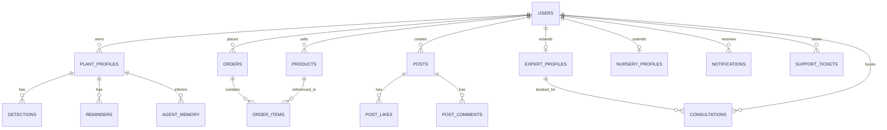

Foreign-key constraints are enforced at the database level throughout, per the PRD's data-integrity NFR, so orphaned detections/orders/consultations are impossible even if application logic has a bug.

## 22. pgvector Design

- `knowledge_chunks.embedding` uses `vector(768)` (dimension matched to whichever embedding model is used; Gemini's embedding endpoint is the default choice to avoid adding a second AI provider).
- An HNSW index (`USING hnsw (embedding vector_cosine_ops)`) is created once the table has enough rows to benefit; for the dataset sizes expected in this project (a few thousand chunks), a plain IVFFlat index or even a sequential scan is acceptable, so the index is added as a straightforward migration rather than a performance emergency.
- Similarity search uses the `<=>` cosine-distance operator, filtered first by `disease_name` when available (cheap pre-filter) and then ranked by distance, keeping queries fast without needing a separate vector database.

## 23. Storage Architecture

All binary assets — plant photos, detection images, profile photos, marketplace product images — are stored in **Supabase Storage buckets**, never on the FastAPI server's filesystem (which is ephemeral on Render). Buckets are split by purpose (`plant-images`, `detection-images`, `profile-photos`, `product-images`) so storage-level access policies can differ per bucket if needed later.

- The frontend uploads directly to Supabase Storage using a signed upload URL issued by the backend, keeping large file bodies off the FastAPI process entirely.
- The backend stores only the resulting object path/URL in Postgres, not the binary.
- Image validation (type, size limit, dimension sanity-check) happens **before** the signed URL is issued, so invalid files are rejected before any storage cost is incurred.

## 24. Authentication Flow

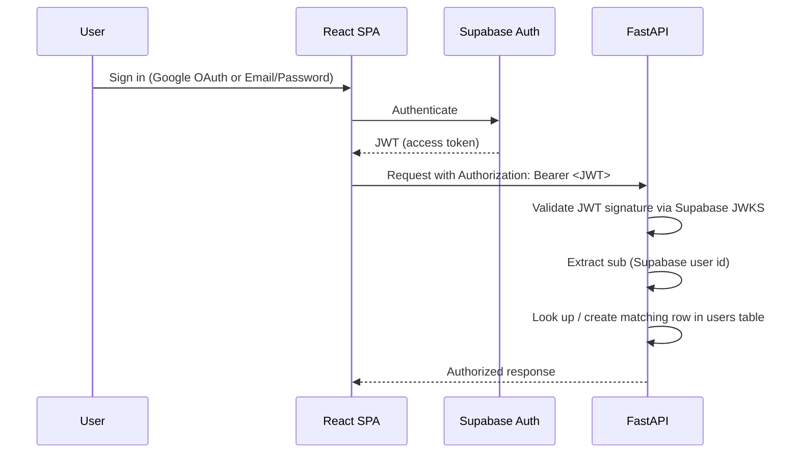

FastAPI never issues or stores passwords; it only verifies JWTs issued by Supabase Auth against Supabase's public JWKS endpoint (cached in-memory with a short TTL to avoid a network call on every request). On first sign-in, a matching `users` row is created (or updated) keyed by the Supabase user ID, linking Supabase's identity system to PlantNest's own relational profile data (role, onboarding fields).

## 25. Authorization Strategy

Authorization is enforced at two layers, deliberately redundant:

1. **Application layer:** FastAPI dependencies check `users.role` (gardener/nursery/expert/admin) before allowing access to role-specific routes (e.g., only a `nursery` role can hit `POST /api/products`).
2. **Database layer:** Postgres Row-Level Security (RLS) policies restrict row visibility so that even a bug in application logic cannot leak another user's plants, detections, or orders — the same principle the PRD calls out in Section 30, now enforced through Supabase's native RLS regardless of which service (FastAPI or a future service) queries the database.

## 26. API Design Standards

- All endpoints are versioned under `/api/v1/`.
- Resource-oriented REST naming (`/plants`, `/detections`, `/orders`), not RPC-style verbs in the URL.
- Pydantic models define every request and response shape; no endpoint returns a raw SQLAlchemy object.
- Pagination via `limit`/`offset` query params on all list endpoints, with a sane default (`limit=20`) to avoid unbounded responses.
- All mutating endpoints require authentication except `POST /api/v1/auth/*` and public product browsing (`GET /api/v1/products`).

## 27. REST API Structure

Endpoints are grouped by the modules defined in Section 8: `auth`, `plants`, `detections`, `reminders`, `weather`, `products`, `orders`, `posts`, `experts`, `consultations`, `notifications`, `support`. This mirrors the PRD's API Structure (Section 25) exactly in resource shape, only relocated from Next.js API routes to FastAPI routers.

## 28. API Endpoint Specifications

| Method & Path | Description | Auth |
| --- | --- | --- |
| POST /api/v1/plants | Add a plant | Required |
| GET /api/v1/plants | List current user's plants | Required |
| PATCH /api/v1/plants/{id} | Edit plant details | Required |
| POST /api/v1/detections | Submit photo for AI diagnosis | Required |
| GET /api/v1/detections?plant_id= | Detection history for a plant | Required |
| GET /api/v1/reminders | List due/upcoming reminders | Required |
| POST /api/v1/reminders/{id}/complete | Mark reminder done | Required |
| GET /api/v1/weather?lat=&lng= | Current + forecast | Required |
| GET /api/v1/products | Browse/search products | Public |
| POST /api/v1/orders | Create order, init Razorpay checkout | Required |
| GET /api/v1/orders/seller | Seller's incoming orders | Required (nursery role) |
| GET /api/v1/posts | Community feed | Required |
| POST /api/v1/posts | Create a post | Required |
| GET /api/v1/experts | Browse expert profiles | Public |
| POST /api/v1/consultations | Submit booking request | Required |
| GET /api/v1/notifications | List notifications | Required |
| POST /api/v1/support/tickets | Raise a support ticket | Required |
| GET /api/v1/health | Health check | Public |

## 29. Request/Response Standards

- Requests and responses use `snake_case` JSON keys, matching Python/Pydantic conventions and avoiding a transformation layer.
- Every list response is wrapped as `{ "items": [...], "total": N, "limit": N, "offset": N }` for consistent client-side pagination handling.
- Timestamps are ISO-8601 UTC strings; the frontend converts to local display time.
- All monetary values are stored and transmitted as integers (paise), never floats, to avoid rounding errors in GST/commission calculations.

## 30. Error Handling Strategy

FastAPI's exception handlers return a consistent error envelope: `{ "error": { "code": "...", "message": "..." } }`, with HTTP status codes used correctly (400 validation, 401 unauthenticated, 403 unauthorized, 404 not found, 429 rate-limited, 500 unexpected). AI-pipeline failures (Gemini timeout, tool failure) are caught inside the `ai` module and degrade gracefully — the API never returns a raw 500 for an agent hiccup; it returns the best partial result available (e.g., diagnosis without a research-backed treatment) with a `partial: true` flag the frontend can render around.

## 31. Background Task Architecture

FastAPI `BackgroundTasks` (no separate queue/broker, consistent with the PRD's explicit decision to omit RabbitMQ/Redis at MVP scale) handles:

- Dispatching in-app and push notifications after a reminder is created, a detection completes, or a consultation status changes.
- Firecrawl ingestion jobs that scrape and embed new knowledge-base content, triggered when the Research Agent flags thin retrieval results.
- Non-blocking write of `agent_memory` entries after an agent interaction completes.

Because `BackgroundTasks` runs in-process after the response is sent, tasks are kept short (a few seconds) and idempotent; anything longer is deliberately out of scope, matching the "keep it simple" instruction for a solo three-month build.

## 32. Image Processing Pipeline

```mermaid
flowchart LR
    A["Client selects/captures image"] --> B["Client-side check: type/size"]
    B --> C["Request signed upload URL from FastAPI"]
    C --> D["Direct upload to Supabase Storage"]
    D --> E["FastAPI receives object path"]
    E --> F["Server-side re-validation (MIME sniff, dimensions)"]
    F --> G["Resize/normalize for model input"]
    G --> H["Pass to Disease Detection Model"]
```

Server-side re-validation is not redundant with the client-side check: the client check is a UX convenience, while the server-side check is the actual security boundary, since a client can always be bypassed.

## 33. Disease Detection Pipeline

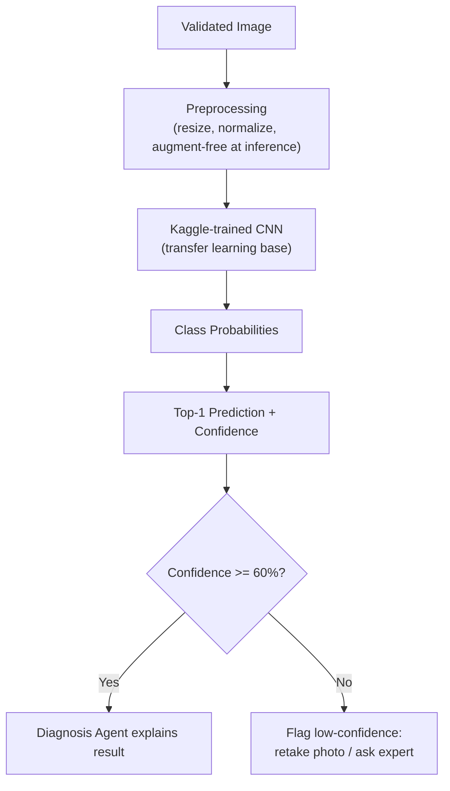

- **Dataset:** a public Kaggle plant-disease image dataset (leaf images labelled by species + disease class), chosen specifically because it is freely licensed and large enough for transfer learning without custom data collection.
- **Preprocessing:** images are resized to the model's expected input size (e.g., 224×224), normalized to the training distribution, and checked for basic sanity (non-blank, plausible aspect ratio) before inference.
- **Inference pipeline:** a CNN built via transfer learning (a pretrained backbone such as MobileNetV2 or EfficientNet-lite, fine-tuned on the Kaggle dataset) is loaded once at service startup and served synchronously in the FastAPI process — small enough to avoid needing a dedicated GPU host.
- **Confidence score:** softmax probability of the top predicted class, thresholded at a configurable value (default 60%, matching the PRD's Section 13.3).
- **Prediction workflow:** validate → preprocess → infer → threshold-check → (explain or escalate).
- **Fallback strategy:** below-threshold results never present a disease name as fact; the UI instead offers "retake photo" or "ask an expert," and the Expert Support Agent pre-fills a booking brief so the human-in-the-loop path is not a dead end.

## 34. AI Recommendation Pipeline

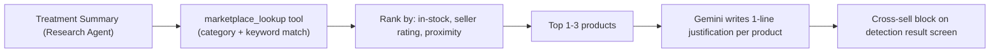

This directly implements FR-12 from the PRD: the result screen surfaces at least one relevant marketplace product, sourced from real inventory rather than a generic suggestion.

## 35. Marketplace Architecture

The marketplace module handles browsing, cart/checkout, and seller order management as a conventional e-commerce flow, integrated with **Razorpay in Test Mode** for payments:

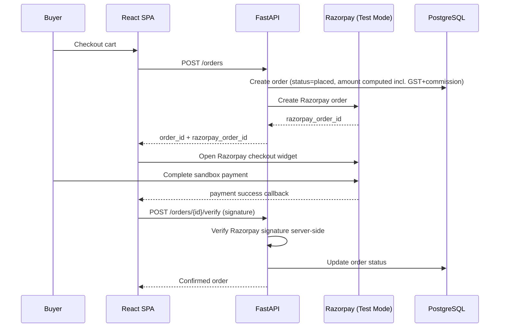

GST and platform commission (Section 16 of the PRD) are computed server-side at order creation, never trusted from the client, and stored per order-item for auditability. No real card data is ever handled by PlantNest — Razorpay's hosted checkout widget takes payment details directly, keeping the project out of PCI-DSS scope entirely, matching the PRD's security stance.

## 36. Expert Consultation Architecture

The MVP-realistic scope from the PRD (Section 15) is preserved exactly: booking plus a basic in-app text thread, with a `mode` field (`chat`/`video`) already present in the data model so a future upgrade to live video is a configuration change, not a schema redesign.

- **Booking:** a gardener requests a time slot against an expert's listed availability; status moves `pending → confirmed` (or `declined`) via a simple state field, with a notification dispatched on each transition.
- **Chat:** implemented as a simple `consultation_messages` table (consultation_id, sender_id, content, created_at) polled by the frontend — no WebSocket infrastructure needed for the MVP's message volume.
- **Video calling:** deliberately architecture-only at this stage, consistent with the PRD deferring the WebRTC SDK integration to "Future." The `mode` column and a placeholder `video_room_url` column exist so that dropping in a provider (e.g., a WebRTC SDK) later requires no migration.

## 37. Notification System

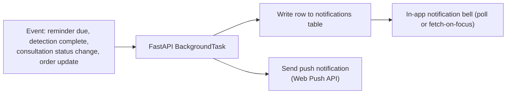

In-app notifications are simply rows in the `notifications` table, fetched by the frontend on load and on focus (no WebSocket needed at this scale). Push notifications use the standard Web Push API with a service worker on the frontend; both are triggered from the same background task so a single event (e.g., "reminder due") never has to duplicate logic across two code paths.

## 38. Security Architecture

- **Row-Level Security (RLS)** on every user-owned table, enforced at the Postgres level regardless of which layer of the app queries it.
- **HTTPS everywhere** (default on Vercel and Render); no plaintext secrets in client-side code — all API keys (Gemini, Exa, Firecrawl, Razorpay) live server-side only, in environment variables.
- **Image validation** before inference, both to control AI/storage cost and reduce abuse surface (matching PRD Section 30).
- **Rate limiting** per user on detection and weather endpoints to protect free-tier quotas.
- **JWT validation** on every protected route via Supabase's JWKS, with no custom session/password handling anywhere in the codebase.
- **Payment security:** Razorpay Test Mode only; server-side signature verification on every payment callback; no card data touches PlantNest's servers.
- **Data minimisation:** only fields a feature actually needs are collected, and account deletion cascades correctly through foreign keys — kept "in spirit" of India's DPDP Act as the PRD specifies, without building full compliance tooling.

## 39. Performance Requirements

| Requirement | Target |
| --- | --- |
| Disease detection result (validation → response) | Under 5 seconds under normal network conditions |
| Standard CRUD API responses (plants, reminders, products) | Under 500ms server-side processing time |
| Weather endpoint (cache hit) | Under 200ms |
| Frontend initial load (Vite build, code-split) | Under 3 seconds on a typical 4G connection |

These map directly to the PRD's Non-Functional Requirements (Section 23) and are not expanded beyond what a free-tier deployment can realistically guarantee.

## 40. Scalability Considerations

As in the PRD (Section 31), the MVP architecture is intentionally a managed-services monolith and should not be over-engineered for a demo build. If PlantNest needed to scale beyond free-tier traffic:

- Render's web service can scale to additional instances behind its load balancer without an architecture change, since the FastAPI app is stateless (all state lives in Postgres/Supabase).
- `weather_cache` and `knowledge_chunks` already reduce repeat third-party calls; a dedicated cache layer (Redis) would only be justified once cache-table contention becomes measurable.
- Supabase read replicas are the natural next step if Postgres read load becomes a bottleneck, before any move toward splitting the monolith into services.
- The disease detection model could move to a dedicated inference server (e.g., a small GPU instance) only once request volume makes in-process inference a bottleneck — not preemptively.

## 41. Caching Strategy

Caching is deliberately minimal and used only where the PRD already identifies a real need:

- `weather_cache` table avoids re-calling the weather API on every dashboard load (same pattern as the PRD's Section 31).
- Supabase's JWKS response is cached in-memory with a short TTL to avoid a network round-trip on every authenticated request.
- No general-purpose cache (Redis, CDN edge caching beyond Vercel's defaults) is introduced, since neither the traffic volume nor the data-change frequency of this project justifies the added moving part.

## 42. Data Validation Strategy

- **Frontend:** Zod schemas validate form input before submission, giving immediate UX feedback.
- **Backend:** Pydantic models validate every request body, query param, and path param; FastAPI rejects malformed requests before they reach service logic.
- **Database:** NOT NULL, foreign key, and check constraints (e.g., `confidence BETWEEN 0 AND 1`, `orders.status IN (...)`) provide a final backstop independent of application code correctness.

## 43. Configuration Management

All environment-specific values are read from environment variables via a single `Settings` object (Pydantic `BaseSettings`), loaded once at startup and injected via FastAPI dependency injection — no scattered `os.environ` calls throughout the codebase. Local development uses a `.env` file (git-ignored); Render and Vercel hold the equivalent values in their respective dashboard secret stores.

## 44. Environment Variables

| Variable | Purpose |
| --- | --- |
| `DATABASE_URL` | PostgreSQL connection string (Supabase) |
| `SUPABASE_URL` / `SUPABASE_JWKS_URL` | JWT validation |
| `SUPABASE_SERVICE_KEY` | Server-side Storage access (signed URLs) |
| `GEMINI_API_KEY` | LLM access |
| `EXA_API_KEY` | Research Agent web search |
| `FIRECRAWL_API_KEY` | Knowledge-base ingestion |
| `RAZORPAY_KEY_ID` / `RAZORPAY_KEY_SECRET` | Payments (test mode) |
| `DETECTION_CONFIDENCE_THRESHOLD` | Low-confidence escalation cutoff (default 0.6) |
| `WEB_PUSH_PUBLIC_KEY` / `WEB_PUSH_PRIVATE_KEY` | Push notifications |
| `FRONTEND_URL` | CORS allow-list |

## 45. Folder Structure

```
plantnest/
├── frontend/
│   ├── src/
│   │   ├── components/        # shadcn/ui-based shared components
│   │   ├── features/          # plants/, detections/, marketplace/, community/, experts/
│   │   ├── lib/                # apiClient, auth context, utils
│   │   ├── routes/
│   │   └── main.tsx
│   └── vite.config.ts
├── backend/
│   ├── app/
│   │   ├── auth/               # router, schemas, service, dependencies
│   │   ├── plants/
│   │   ├── detections/
│   │   ├── reminders/
│   │   ├── marketplace/
│   │   ├── community/
│   │   ├── experts/
│   │   ├── notifications/
│   │   ├── ai/
│   │   │   ├── agents/         # diagnosis, research, care, recommendation, expert_support
│   │   │   ├── model/          # Kaggle-trained CNN + preprocessing
│   │   │   ├── rag/            # embedding + retrieval
│   │   │   └── gemini_client.py
│   │   ├── core/               # settings, security, db session
│   │   └── main.py
│   └── alembic/                # database migrations
└── README.md
```

## 46. Coding Standards

- **Python (backend):** PEP 8, type hints everywhere, Pydantic models for all I/O boundaries, `ruff` for linting/formatting.
- **TypeScript (frontend):** `strict` mode enabled, ESLint + Prettier, no implicit `any`.
- Every module follows the router → service → repository layering from Section 7 without exception, so a new contributor (or an evaluator reading the code) can predict where any given piece of logic lives.
- No business logic in route handlers or React components beyond simple presentational conditionals.

## 47. Naming Conventions

| Element | Convention | Example |
| --- | --- | --- |
| Python files/functions | `snake_case` | `get_plant_detections()` |
| Python classes | `PascalCase` | `DetectionService` |
| React components | `PascalCase` | `PlantCard.tsx` |
| React hooks | `camelCase`, `use` prefix | `usePlantDetections()` |
| Database tables/columns | `snake_case`, plural table names | `plant_profiles`, `created_at` |
| API routes | kebab-case where multi-word | `/api/v1/order-items` |
| Environment variables | `SCREAMING_SNAKE_CASE` | `GEMINI_API_KEY` |

## 48. Testing Strategy

Kept proportionate to a solo, three-month build — depth on the features that matter most for the viva, not blanket coverage:

- **Backend:** `pytest` unit tests for service-layer business logic (reminder scheduling, GST/commission calculation, confidence-threshold branching) and integration tests for the core detection endpoint using a test database.
- **AI pipeline:** deterministic tests for the non-LLM parts (preprocessing, threshold logic, RAG retrieval ranking) plus a small set of recorded-response tests for agent prompts (mocking the Gemini client) to catch prompt-format regressions without incurring live API cost on every test run.
- **Frontend:** component tests (Vitest + React Testing Library) for the disease-detection result screen and checkout flow, the two highest-stakes UI surfaces per the PRD.
- **Manual/demo testing:** the PRD's own risk mitigation (Section 34) of pre-testing exact demo photos is treated as part of the test plan, not just a presentation tactic.

## 49. Deployment Architecture

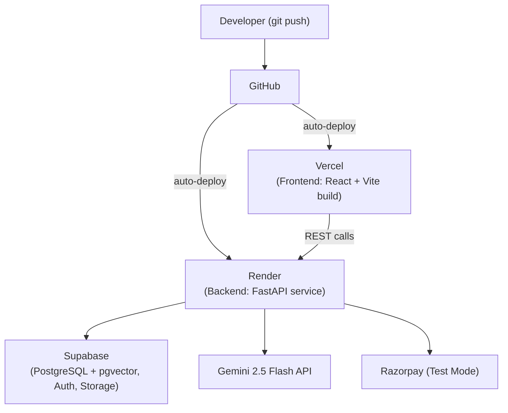

- **Frontend:** deployed on Vercel, built from the `frontend/` directory; push-to-deploy from `main`, with preview deployments per pull request.
- **Backend:** deployed on Render as a web service running the FastAPI app (via `uvicorn`), also push-to-deploy from `main`.
- **Database, Auth, Storage:** entirely managed by Supabase; no self-hosted database or file server.
- **Secrets:** configured in Vercel's and Render's respective environment variable dashboards, never committed to the repository.

## 50. Logging

Kept simple and free-tier appropriate, per instructions — no enterprise observability stack:

- **Application logs:** structured (JSON) logs written to stdout, which Render captures natively in its dashboard; each log line includes the request ID from the logging middleware (Section 18).
- **Error logs:** unhandled exceptions are logged with a full traceback at ERROR level; the global exception handler (Section 30) ensures every error is logged exactly once, at the point it's caught.
- **Health endpoint:** `GET /api/v1/health` returns `{"status": "ok", "db": "ok"|"down"}`, checked by a lightweight DB ping, used both for manual verification and as a target for Render's own health-check pings.

## 51. Future Technical Improvements

- Fine-tune the disease detection model further once real, user-confirmed detection outcomes accumulate (mirrors the PRD's Future Expansion, Section 35).
- Move from FastAPI `BackgroundTasks` to a lightweight task queue (e.g., Celery with Redis, or Supabase's own queue features) only if background workloads grow past what in-process tasks can handle.
- Add a dedicated caching layer once traffic patterns justify it (Section 41).
- Extend the RAG knowledge base with continuously scheduled Firecrawl ingestion runs rather than on-demand-only triggers.
- Replace polling-based chat (Section 36) with WebSockets if live chat volume grows, ahead of the video-calling upgrade.

## 52. Assumptions

- The developer has access to free-tier accounts for Vercel, Render, Supabase, Gemini API, ExaTools, FirecrawlTools, and Razorpay Test Mode for the full build window.
- A suitable Kaggle plant-disease dataset is available under a license permitting use in a student project (e.g., PlantVillage or an equivalent public dataset).
- Traffic during development and demo remains low enough that all free-tier quotas (Gemini, Exa, Firecrawl, Render, Supabase) are sufficient without upgrading to paid tiers.
- The single developer has working familiarity with both the frontend and backend stacks chosen here; ramp-up time on any unfamiliar piece (e.g., Agno, pgvector) is accounted for within the three-month window per the PRD's roadmap philosophy.

## 53. Risks and Technical Constraints

| Risk / Constraint | Impact | Mitigation |
| --- | --- | --- |
| Gemini/Exa/Firecrawl free-tier rate limits hit during development or demo | High — breaks the AI-centric core feature | Cache agent outputs where possible; pre-test demo detections ahead of time (mirrors PRD Section 34) |
| Kaggle dataset quality/size insufficient for a reliable CNN | Medium — weak diagnosis accuracy undermines trust | Use transfer learning from a strong pretrained backbone rather than training from scratch; lean into the confidence-threshold UX as the PRD already frames it (Section 13.3) |
| Multi-agent orchestration adds complexity for a solo developer | Medium — risk of over-engineering the AI layer | Keep agents narrow and stateless where possible; treat Section 11's five agents as a fixed, non-expanding list for MVP |
| Render free-tier cold starts add latency to the first request after idle | Low–Medium — could affect a live demo's first call | Warm the service with a health-check ping shortly before a scheduled demo |
| pgvector/RAG knowledge base starts too small to be useful | Low — Research Agent falls back to Exa/Firecrawl live search, which is slower but still correct | Pre-seed `knowledge_chunks` from Kaggle metadata before the demo rather than relying solely on live ingestion |
| Solo-developer time constraints (coursework overlap) | Medium — same risk the PRD identifies at product level, now also a technical-scope risk | Treat Sections 9–17 (AI system) as the first-priority technical build, since it is the PRD's centrepiece feature; defer non-critical polish (Section 51) without exception |

---

*This TRD is a living technical companion to the PlantNest PRD (v1.0) and should be revisited if any functional requirement in the PRD changes during development.*
